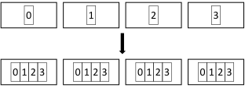
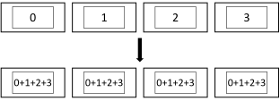
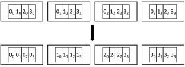
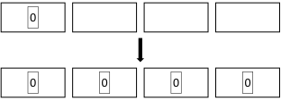
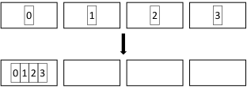
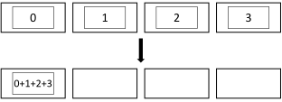
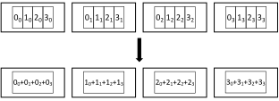
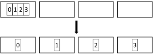

Overview of Communication Operations
====================================

Aluminum's communication operations very closely resemble those provided by MPI, but a couple differ in some key ways.
This page documents the semantics of all the operations to provide a reference.
See the API documentation for details on exact arguments.

However, first it is helpful to give some general terminology.

.. _comm-nonblocking:

Non-Blocking Operations
-----------------------

All operations have non-blocking variants (see :ref:`nonblocking-comm`) which return immediately and execute communication on a separate compute stream.
When the result is needed, the operation can be waited on.
If it has finished in the background, this is very low overhead; if not, this will wait until it does complete.
It is never safe to modify a buffer that a non-blocking operation is using until it has completed; it is safe to read from a buffer that the operation only reads from before completion, but it is not safe to read from a buffer that the operation writes to before completion.

While this makes sense for most operations, it is worth noting non-blocking barriers can be a bit confusing.
Their main use is to signal that a particular point in the application has been reached without requiring all the processes to immediately wait.

In Aluminum, the :cpp:func:`Al::Wait()` and :cpp:func:`Al::Test()` methods are used to synchronize with non-blocking operations.
``Wait`` is typically preferred, and will wait for the corresponding collective operation to complete.
If you use this on an accelerator backend, this will result in the accelerator waiting for the operation to complete, *not* the host CPU.
``Test`` is **always** a host-side operation, and will return ``true`` if the operation has completed, and ``false`` otherwise.

.. _comm-inplace:

In-Place Operations
-------------------

Nearly all operations have in-place variants (some, such as broadcast, are only in-place).
This means that the same buffer is used to both send and receive data.
Depending on the operation, there may be specific semantics about where in the buffer send data needs to be placed by the caller or where received data will be placed by Aluminum.
In some cases, this can save memory (because you only need one buffer) and be faster (because other buffers need not be initialized or copied).
In other cases, the semantics of the operation and system limitations may still require a separate buffer.
In these cases, either the underlying library or Aluminum handles this.

.. _comm-rooted:

Rooted Operations
-----------------

Certain operations have "roots", which distinguish a special rank in the collective.
While it is common for the root to be rank 0, they can be any rank.
The root typically operates differently than all the other ranks, and may need different sized buffers.
Typically, the root is responsible for providing data that will be received by all other ranks (e.g., in ``Bcast`` or ``Scatter``) or receiving all data produced by both it and other ranks (e.g., in ``Gather`` or ``Reduce``).

.. _comm-reduction:

Reductions
----------

Some operations are *reduction* operations: they combine vectors of data.
This combination is always done element-wise.
The prototypical reduction operation is summation, but you can use other operations (e.g., maximum).

Certain Aluminum backends also support averaging as a reduction operation.
(Averaging vectors is technically not a reduction for slightly complicated reasons, but it is useful to treat it as such.)

.. _comm-vector:

Vector Operations
-----------------

Some collectives have *vector* variants, denoted by a "v" at the end of the name (e.g., ``Allgatherv`` is the vector version of ``Allgather``).
Normally, every rank in a collective operates on data that is the same length.
Vector operations relax this and allow each rank to provide data of different lengths (including empty vector).
However, this now means that the length of each vector from each rank may need to be known globally.

Aluminum follows MPI in its vector operation API and requires callers to provide both a base buffer pointer and a vector of displacements.
The displacements indicate the offset from the base buffer pointer where each rank's data will be read from or written to.
These displacements do not need to be contiguous, and the first one does not need to be 0.

Vector operations can be useful for implementing communication on sparse or irregular data.

Point-to-Point Operations
-------------------------

These are operations in which data is sent directly between two processes, and other processes are not involved.

.. _send-and-recv:

Send and Receive
^^^^^^^^^^^^^^^^

These are the most basic communication operations, and need to be paired: one process sends data and the other process receives the data.

There are some subtleties here that one should be aware of:

* Unlike MPI, Aluminum does not support tagged messages.
* Also unlike MPI, a receive will only match a send with the exact same ``count`` (whereas MPI treats the receive count as an upper bound).
* You should properly order your sends and receives, so that you start your sends and receives in the same order.
* Finally, note that sends may (but are not guaranteed) to complete *before* the data has been sent or before it has been received (it is, however, safe to read or modify a send buffer after the send has completed).

There are no special in-place versions of send or receive, as they only have one buffer argument.

* :cpp:func:`Al::Send()`
* :cpp:func:`Al::NonblockingSend()`
* :cpp:func:`Al::Recv()`
* :cpp:func:`Al::NonblockingRecv()`

.. _sendrecv:

SendRecv
^^^^^^^^

``SendRecv`` combines a send and a receive into a single call.
This is useful when processes need to exchange data, as it simplifies the process.
Using only blocking ``Send`` and ``Recv``, processes need to send and receive in the right order (e.g., all even processes send first) to avoid deadlocks; ``SendRecv`` handles this automatically.
(Note you can achieve similar results using non-blocking operations, but ``SendRecv`` is still simpler.)

``SendRecv`` may send to and receive from different ranks.

There is an in-place version of ``SendRecv`` (this is similar to ``MPI_Sendrecv_replace``), in which the data in the provided buffer is first sent, then replaced with the received data.

* :cpp:func:`Al::SendRecv()`
* :cpp:func:`Al::NonblockingSendRecv()`

.. _multisendrecv

MultiSendRecv
^^^^^^^^^^^^^

This implements an arbitrary sequence of ``Send`` and ``Recv`` operations as a single operation.
This is similar to an ``Alltoall`` collective, but does not require that all ranks in a communicator participate.
Likewise, unlike a sequence of ``SendRecv`` operations, this does not require all ranks to both send and receive; i.e., there may be asymmetric communication.

There is an in-place version of ``MultiSendRecv``, which differs slightly from a regular ``MultiSendRecv``: It functions exactly like a sequence of in-place ``SendRecv`` operations.

* :cpp:func:`Al::MultiSendRecv()`
* :cpp:func:`Al::NonblockingMultiSendRecv()`

Collective Operations
---------------------

Collectives are communication operations where all ranks in a communicator must participate.
(If any rank does not call the collective, all the ranks may hang.)
While in principle you could implement all of them using point-to-point operations, using collectives is both simpler and allows one to take advantage of more efficient algorithms and optimized implementations for specific operations.

.. _allgather:

Allgather
^^^^^^^^^

In ``Allgather``, all ranks contribute a slice of data, and after completion, all ranks will have all data, concatenated in rank number order.
``Allgather`` is similar to ``Gather``, except all ranks receive the gathered result, rather than just the root.

For an in-place ``Allgather``, the send data must be placed at the location in the buffer where it would be received.

* :cpp:func:`Al::Allgather()`
* :cpp:func:`Al::NonblockingAllgather()`

.. _allgatherv:

Allgatherv (vector Allgather)
^^^^^^^^^^^^^^^^^^^^^^^^^^^^^

This is the vector version of ``Allgather``, and operates the same way, except that each rank may contribute a slice of a different length.

* :cpp:func:`Al::Allgatherv()`
* :cpp:func:`Al::NonblockingAllgatherv()`

.. _allreduce:

Allreduce
^^^^^^^^^

``Allredue`` is a collective reduction where all ranks contribute a vector of data, the element-wise reduction of the vectors is computed, and all ranks receive the final reduced result.
``Allreduce`` is similar to ``Reduce``, except all ranks receive the reduced result, rather than just the root.

For an in-place ``Allreduce``, the same buffer is used for both each rank's initial vector and will contain the final result.

* :cpp:func:`Al::Allreduce()`
* :cpp:func:`Al::NonblockingAllreduce()`

.. _alltoall:

Alltoall
^^^^^^^^

In ``Alltoall``, each rank has a vector of data which consists one equal-sized equal-sized slice per rank (including the caller, stored contiguously).
After completion, each rank will have all the slices corresponding to its rank, contributed by each rank, stored in rank order.
Conceptually, this is equivalent to each rank performing a ``Scatter``; or to an ``Allgather`` where each rank sends distinct data to each other rank.

For an in-place ``Alltoall``, the same buffer is used for both each rank's initial vector and will contain the final vector.

* :cpp:func:`Al::Alltoall()`
* :cpp:func:`Al::NonblockingAlltoall()`

.. _alltoallv:

Alltoallv (vector Alltoall)
^^^^^^^^^^^^^^^^^^^^^^^^^^^

This is the vector version of ``Alltoall``, and operates the same way, except that each rank may contribute a slice of a different length for each other rank.

* :cpp:func:`Al::Alltoallv()`
* :cpp:func:`Al::NonblockingAlltoallv()`

.. _barrier:

Barrier
^^^^^^^

A ``Barrier`` is an operation that does not complete until all ranks in a communicator have called the ``Barrier`` operation.
No data is exchanged; this is a synchronization operation.

There is no in-place ``Barrier``, as no data is communicated.

* :cpp:func:`Al::Barrier()`
* :cpp:func:`Al::NonblockingBarrier()`

.. _bcast:

Bcast
^^^^^^^^^

``Bcast`` is a rooted collective in which the root transmits a vector of data that all other ranks will receive.
It is always in-place.

* :cpp:func:`Al::Bcast()`
* :cpp:func:`Al::NonblockingBcast()`

.. _gather:

Gather
^^^^^^

``Gather`` is a rooted collective in which each rank contributes a slice of data, and the root receives each slice, concatenated in rank order.

For an in-place ``Gather``, the root places its contribution at the location in the buffer where it would be received in rank order.
There is only one buffer used on non-roots regardless of whether the operation is in-place.

* :cpp:func:`Al::Gather()`
* :cpp:func:`Al::NonblockingGather()`

.. _gatherv:

Gatherv (vector Gather)
^^^^^^^^^^^^^^^^^^^^^^^

This is the vector version of ``Gather``, and operates the same way, except each rank may contribute a slice of a different length.

* :cpp:func:`Al::Gatherv()`
* :cpp:func:`Al::NonblockingGatherv()`

.. _reduce:

Reduce
^^^^^^

``Reduce`` is a rooted collective reduction in which each rank contributes a vector of data, the element-wise reduction of the vectors is computed, and the root receives the final reduced result.

For an in-place ``Reduce``, the same buffer is used for both the root's initial vector and will contaun the final result.
There is only one buffer used on non-roots regardless of whether the operation is in-place.

* :cpp:func:`Al::Reduce()`
* :cpp:func:`Al::NonblockingReduce()`

.. _reduce-scatter:

Reduce-scatter
^^^^^^^^^^^^^^

``Reduce_scatter`` is a collective reduction where each rank contributes a vector of data, the element-wise reduction of the vectors is computed, and then each rank receives a slice of the final reduced result corresponding to its rank.
Conceptually, this is equivalent to a ``Reduce`` followed by a ``Scatter``.

For an in-place ``Reduce_scatter``, the same buffer is used for both each rank's contribution and will contain its final reduced slice.
The slice will be placed at the beginning of the buffer.

*Note*: If you are coming from MPI, this is equivalent to ``MPI_Reduce_scatter_block``.
See ``Reduce_scatterv`` for the operation equivalent to ``MPI_Reduce_scatter``.

* :cpp:func:`Al::Reduce_scatter()`
* :cpp:func:`Al::NonblockingReduce_scatter()`

.. _reduce-scatterv:

Reduce-scatterv (vector Reduce-scatter)
^^^^^^^^^^^^^^^^^^^^^^^^^^^^^^^^^^^^^^^

This is the vector version of ``Reduce_scatter``, and operates the same way, except that the slice each rank receives may be a different length.
Note that the input vectors must still be the same length.

*Note*: If you are coming from MPI, this is equivalent to ``MPI_Reduce_scatter``.
See ``Reduce_scatter`` for the operation equivalent to ``MPI_Reduce_scatter_block``.

* :cpp:func:`Al::Reduce_scatterv()`
* :cpp:func:`Al::NonblockingReduce_scatterv()`

.. _scatter:

Scatter
^^^^^^^

``Scatter`` is a rooted collective in which the root has a vector of data consisting of one equal-sized slice per rank (including itself), and each rank will receive the slice corresponding to its rank.

For an in-place ``Scatter``, the root uses the same buffer for both its contribution and receiving its slice, and the slice is in the location corresponding to the root's rank.
There is only one buffer used on non-roots regardless of whether the operation is in-place.

* :cpp:func:`Al::Scatter()`
* :cpp:func:`Al::NonblockingScatter()`

.. _scatterv:

Scatterv
^^^^^^^^

This is the vector version of ``Scatter``, and operates the same way, except the slice sent to each rank may be a different length.

* :cpp:func:`Al::Scatterv()`
* :cpp:func:`Al::NonblockingScatterv()`
