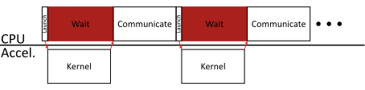
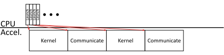

|AlLogo| Aluminum Communication Library
=======================================

Aluminum is a high-performance communication library for CPUs, GPUs, and other accelerator platforms.
It leverages existing libraries, such as MPI, NCCL, and RCCL, plus its own infrastructure, to deliver performance and accelerator-centric communication.

Aluminum is open-source and maintained by the Lawrence Livermore National Laboratory.
If you use Aluminum in an academic context, please cite our `paper <https://ieeexplore.ieee.org/document/8638639>`_:

.. code-block:: bibtex

   @inproceedings{dryden2018aluminum,
     title={Aluminum: An Asynchronous, {GPU}-Aware Communication Library Optimized for Large-Scale Training of Deep Neural Networks on {HPC} Systems},
     author={Dryden, Nikoli and Maruyama, Naoya and Moon, Tim and Benson, Tom and Yoo, Andy and Snir, Marc and Van Essen, Brian},
     booktitle={Proceedings of the Workshop on Machine Learning in HPC Environments (MLHPC)},
     year={2018}
   }

Aluminum currently supports the following communication backends:

* ``MPI``: Uses the Message Passing Interface and supports any hardware your underlying MPI library supports.
* ``NCCL``: Uses either Nvidia's `NCCL <https://developer.nvidia.com/nccl>`_ library for Nvidia GPUs or AMD's `RCCL <https://github.com/ROCmSoftwarePlatform/rccl>`_ library for AMD GPUs.
* ``HostTransfer``: Uses MPI plus the CUDA or HIP runtime to support Nvidia or AMD GPUs without specialized libraries.

Specific documentation pages of interest:

* :doc:`build`
* :doc:`start`
* :doc:`comm`

*Note*: This documentation assumes one has a basic familiarity with MPI and GPU (CUDA/HIP) terminology.

Accelerator-Centric Communication
---------------------------------

Aluminum's accelerator backends (``NCCL``, ``HostTransfer``) provide *accelerator-centric communication*.
This means that your communication operations properly synchronize with computations on your accelerator, and Aluminum handles the details (in a nutshell, communication functions "just like a kernel").
More precisely, in Aluminum, a communicator is associated with a compute stream (e.g., a CUDA stream), and all communication performed on that communicator will synchronize with other operations on that stream.
This means that the communication will not start until all operations already enqueued on the stream at the time the communication operation was called will complete first; and no operation enqueued on the stream after the communication operation will execute until the communication completes.
Further, the communication proceeds asynchronously from the caller and will not block the host thread.

Why is this useful?
This allows you to avoid excessive synchronization between the host and accelerator, and consequently to avoid kernel launch overheads.
To see why, it helps to consider how one would typically perform communication on an accelerator buffer using MPI:

In short, because MPI does not (indeed, under the current standard, 4.0, *cannot*, even with a GPU-aware MPI library) know about computation on an accelerator compute stream, or interact with that stream, the user must manually complete outstanding computation, perform the communication, then subsequently continue computation (in essence, a traditional bulk-synchronous paradigm).
Aluminum uses the fact that it knows the compute stream to internally manage the appropriate synchronization and leverage accelerator-specific primitives to enable the same process to look more like this:

We have saved the overhead of the waits, hidden most of the kernel launch overhead, and freed the CPU to do other work.

(Note: This is not to say that one cannot do this manually, just that doing it well and in a performant way is a bit tricky, and if you do so, you're at least part-way to rewriting Aluminum, so you might as well just use it.
Indeed, there are at least a couple of proposals that have cropped up subsequent to Aluminum proposing someting similar (`here <https://arxiv.org/abs/2208.04817>`__ and `here <https://arxiv.org/abs/2208.13707>`__).)

.. _nonblocking-comm:

Non-Blocking Communication
--------------------------

Aluminum provides support for non-blocking operations in all backends.
This means that when the operations execute, they do not block their stream of computation until completion is explicitly requested, allowing communication to proceed concurrently with computation ("hiding" the overhead of communication).
Logically, this is the same as non-blocking MPI operations, but with Aluminum this also functions for accelerators (by using internal streams).

.. _thread-safety:

Thread Safety
-------------

Aluminum provides different levels of thread safety, depending on user requirements.
This must be chosen at compile time.
Aluminum is always to use in the presence of external threads which do not interact with Aluminum, but offers different guarantees when multiple threads may call Aluminum APIs:

* By default, only a single thread may call Aluminum APIs at a given time. However, it is safe to use different threads to interact with Aluminum, so long as access is synchronized by the caller. (This is equivalent to ``MPI_THREAD_SYNCHRONIZED``.)
* When built with ``ALUMINUM_ENABLE_THREAD_MULTIPLE=YES``, multiple threads may make concurrent Aluminum API calls. It is up to the caller to ensure that there are no cyclic dependencies, deadlocks, races, or the like. In particular, multiple threads should not execute concurrent operations on the same communicator, as the order the operations will run in is undefined. (This is equivalent to ``MPI_THREAD_MULTIPLE``.)

.. toctree::
   :maxdepth: 2
   :caption: Contents:

   self
   build
   start
   comm
   api

Indices and tables
==================

* :ref:`genindex`
* :ref:`search`
